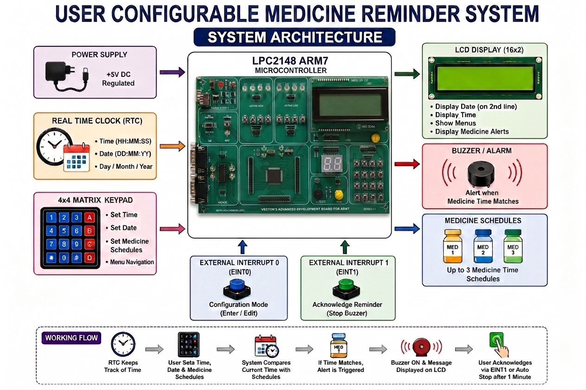
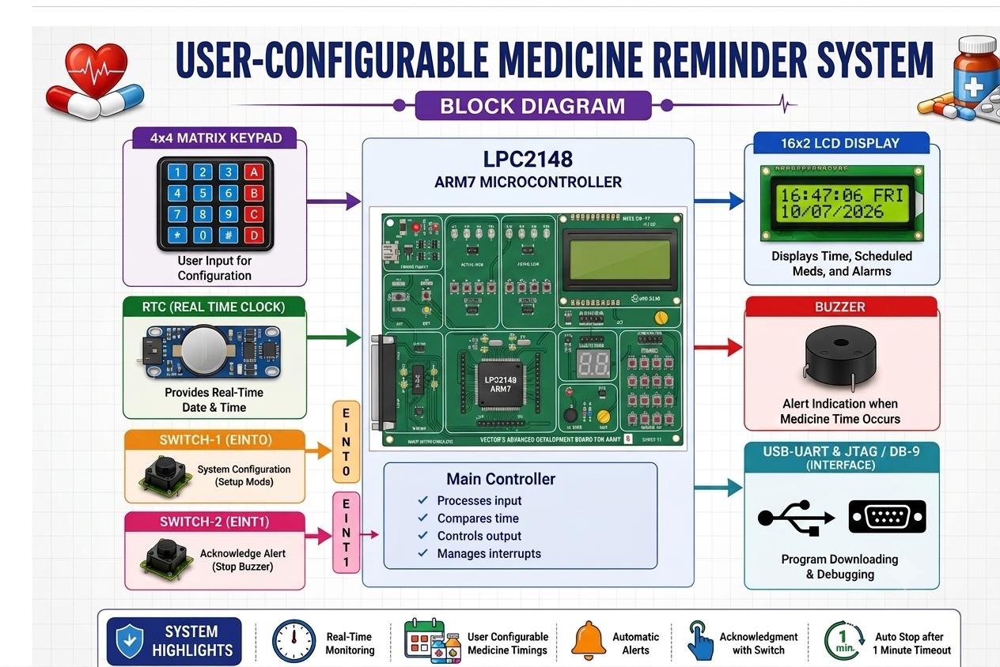
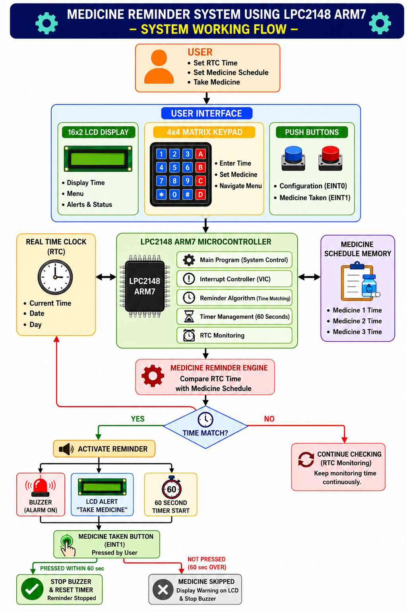
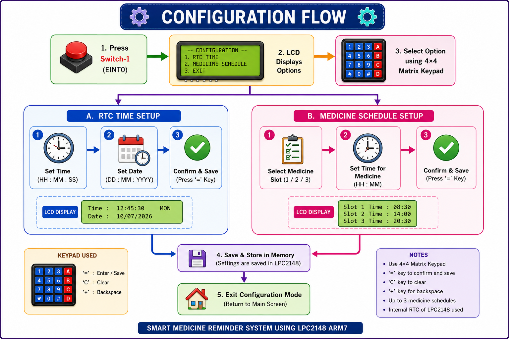
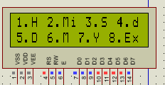
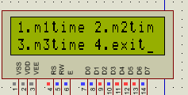
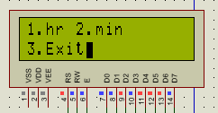
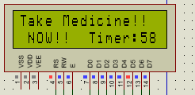
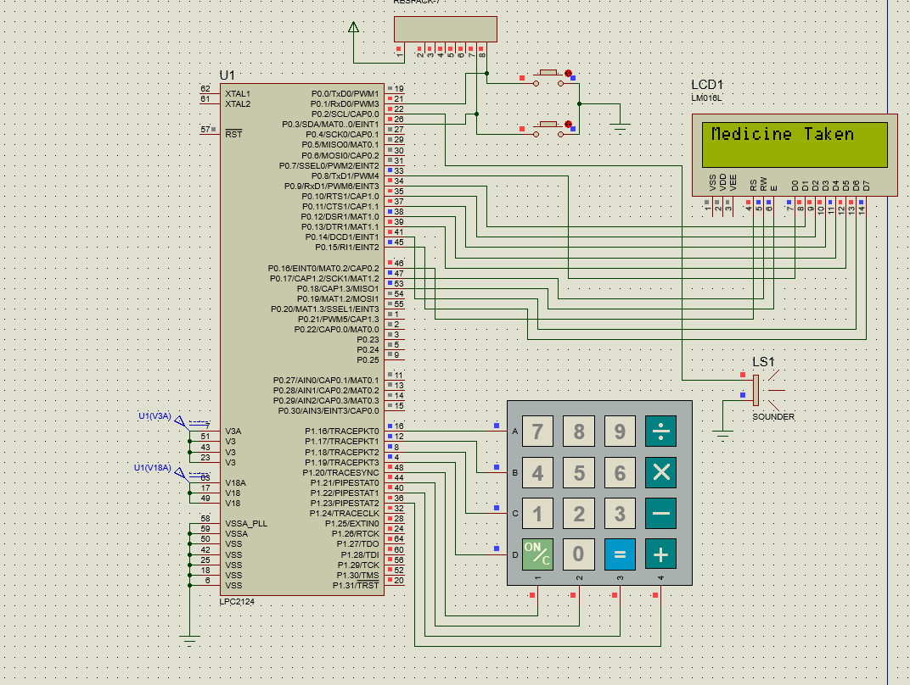

# 💊 User Configurable Medicine Reminder System Using LPC2148 ARM7

---

# 📌 Project Description

The **Smart Medicine Reminder System** is an embedded healthcare application developed using the **LPC2148 ARM7 microcontroller**. The project helps users remember their medication by continuously monitoring the current date and time through the **internal Real-Time Clock (RTC)**.

Users can configure the RTC as well as three individual medicine reminder timings using a **4×4 matrix keypad**. Whenever the current RTC time matches one of the stored schedules, the system displays a reminder on the **16×2 LCD** and activates the **buzzer**.

The reminder can be acknowledged by pressing **External Interrupt 1 (EINT1)**. If no response is received, the buzzer automatically turns OFF after one minute. Configuration mode is entered using **External Interrupt 0 (EINT0)**.

---

# 🎯 Objectives

- Display real-time clock information on LCD
- Configure RTC date and time
- Store three medicine reminder timings
- Compare RTC values with stored schedules
- Generate medicine alerts automatically
- Acknowledge reminders using EINT1
- Stop reminder automatically after one minute
- Provide an easy keypad-based configuration interface

---

# ✨ Project Highlights

- Internal RTC implementation
- 16×2 LCD interface
- 4×4 Matrix Keypad input
- Three configurable medicine schedules
- Interrupt-driven configuration
- Interrupt-based reminder acknowledgement
- Automatic buzzer timeout
- Developed in Embedded C using Keil μVision

---

# 🏗️ System Architecture

---

# 🔧 Hardware Requirements

| Component | Purpose |
|------------|---------|
| LPC2148 ARM7 | Main Controller |
| Internal RTC | Real-Time Clock |
| 16×2 LCD | Display Unit |
| 4×4 Matrix Keypad | User Input |
| Buzzer | Alert Indication |
| Push Button (EINT0) | Configuration Mode |
| Push Button (EINT1) | Reminder Acknowledge |
| USB-UART| Programming and Communication |

---

# 📦 Hardware Block Diagram

---

# 📦 System Working Flow

---

# 📍 Pin Connections

| Peripheral | LPC2148 Pin |
|-------------|-------------|
| LCD Data | P0.8 – P0.15 |
| LCD RS | P0.16 |
| LCD RW | P0.17 |
| LCD EN | P0.18 |
| Buzzer | P2.0 |
| EINT0 Switch | P0.1 |
| EINT1 Switch | P0.3 |
| Keypad Rows | P1.16 – P1.19 |
| Keypad Columns | P1.20 – P1.23 |

---

# 🔧 System Configuration Mode

Press **Switch-1 (EINT0)** to enter Configuration Mode.

The LCD displays the available options:

- 🕒 Edit RTC
- 💊 Set Medicine time

Use the **4×4 Matrix Keypad** to select and configure the required option.

---

# 🛠 Configuration Flow

- Press **Switch-1 (EINT0)** to enter setup mode.
- Select **RTC** or **Medicine Schedule**.
- Configure using the **4×4 Matrix Keypad**.

---

# 🕒RTC Time Configuration

The RTC configuration feature allows the user to modify the current system date and time.

---

# 💊 Medicine Reminder Schedule

The project supports three independent reminder slots.

| Reminder | Example Time |
|-----------|--------------|
| Medicine 1 | 08:30 AM |
| Medicine 2 | 02:00 PM |
| Medicine 3 | 20:15 PM |

---

# 🔔Medicine Alert System

When the reminder time is reached:
- LCD shows **"Take Medicine Now"**
- Buzzer turns ON
- System waits for user response
- Press **Switch-2 (EINT1)** to stop the reminder

---

# ⏱ Alert Timeout Mechanism

The reminder remains active for **1 minute**.
- If **Switch-2 (EINT1)** is pressed within 1 minute:
  - Buzzer turns OFF
  - Reminder is cleared
  - System returns to normal monitoring

- If **Switch-2 is not pressed** within 1 minute:
  - Buzzer turns OFF automatically
  - Reminder is cleared
  - System continues checking the RTC for the next reminder

# ⏱ Reminder Timeout

- Reminder stays active for **1 minute**.
- Press **Switch-2 (EINT1)** to stop the reminder.
- If no button is pressed, the buzzer stops automatically after 1 minute.
- The system then continues monitoring the RTC for the next reminder.

# 🔄Complete System Flowchart

---

# 🔧 Communication & Interface

| Device | Interface |
|----------|------------|
| RTC | I2C |
| LCD | GPIO |
| Matrix Keypad | GPIO |
| Buzzer | GPIO |
| Switch-1 | EINT0 |
| Switch-2 | EINT1 |

---

# 📷 Project Demonstration

---

# 💻 Software Tools

- Embedded C
- Keil μVision IDE
- Flash Magic

---

# 🚀 Future Improvements

- GSM module for SMS notifications
- IoT-based remote monitoring
- Mobile application integration
- EEPROM-based schedule backup
- Voice reminder system
- Wi-Fi connectivity
- Multi-user medicine scheduling

---

# 🌍 Applications

- Personal medicine reminder devices
- Elderly healthcare systems
- Home healthcare monitoring
- Hospitals and clinics
- Embedded medical devices

---

# 👩‍💻 Developer

**Kotha Sangeetha**

**Bachelor of Technology (Electronics and Communication Engineering)**

 2025 Graduate
  
---

# 📜 License

This project is developed for **academic learning and educational purposes**.
Feel free to fork, modify, and improve the project.

---

# 🙏 Thank You

Thank you for visiting this project.

If you found this project useful, consider giving this repository a **⭐ Star** and feel free to fork it for learning purposes.
