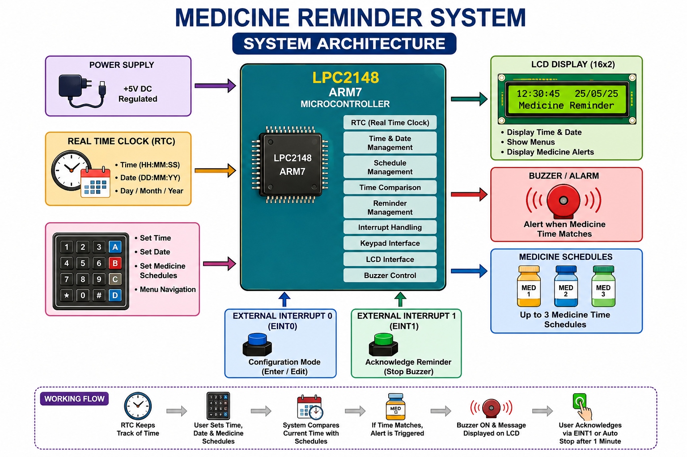
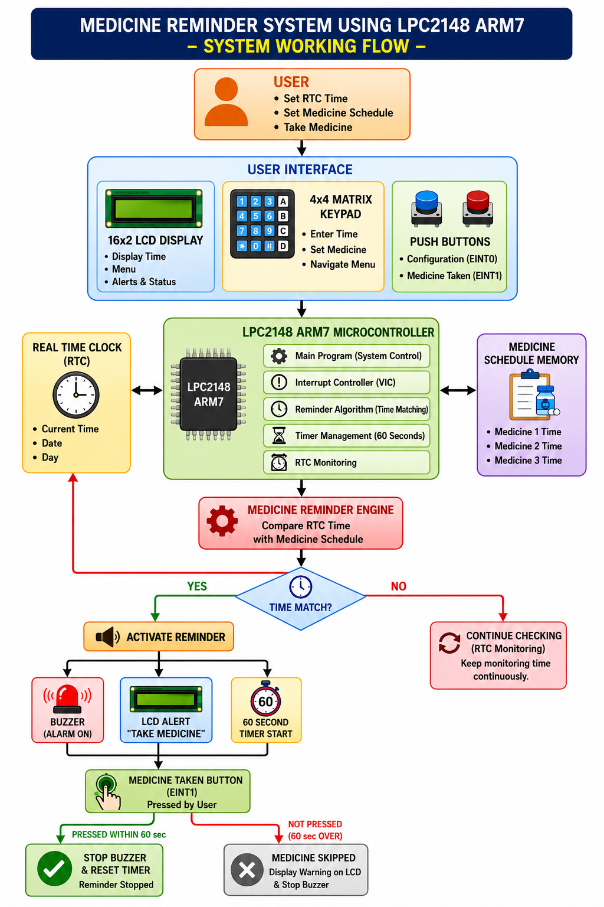
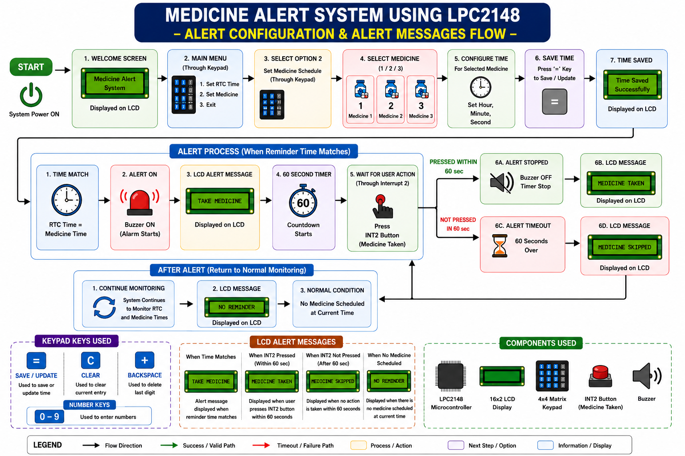
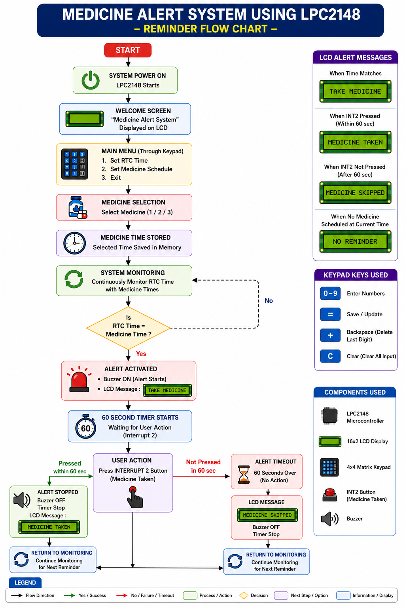
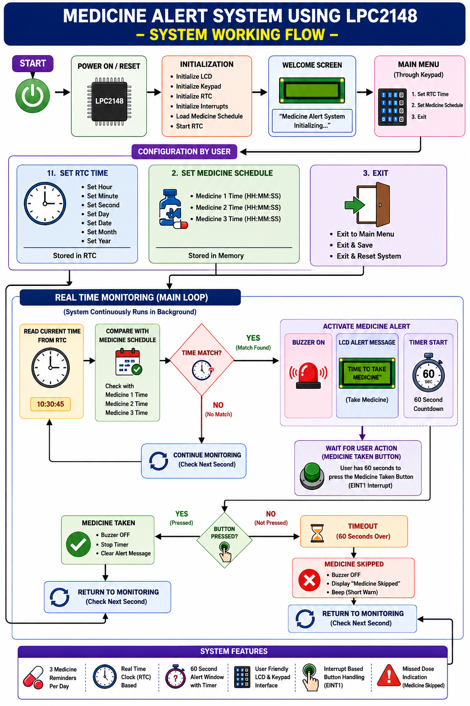
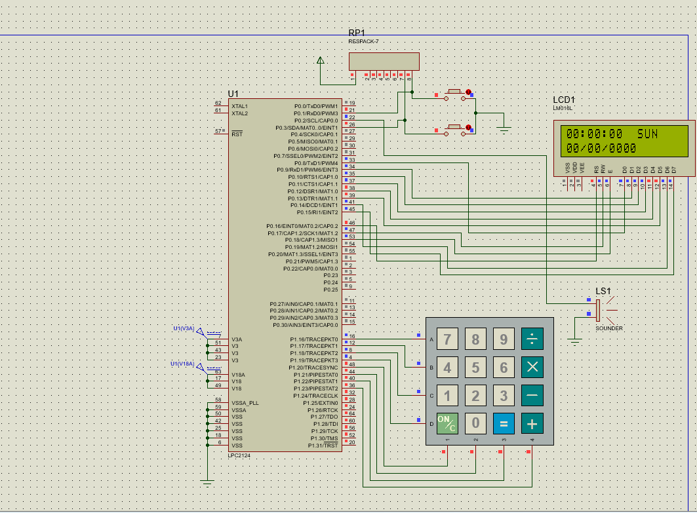
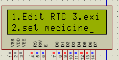

# 💊 Smart Medicine Reminder System | LPC2148 ARM7

<p align="center">


</p>

---

# 📌 Project Description

The **Smart Medicine Reminder System** is an embedded healthcare application developed using the **LPC2148 ARM7 microcontroller**. The project helps users remember their medication by continuously monitoring the current date and time through the **internal Real-Time Clock (RTC)**.

Users can configure the RTC as well as three individual medicine reminder timings using a **4×4 matrix keypad**. Whenever the current RTC time matches one of the stored schedules, the system displays a reminder on the **16×2 LCD** and activates the **buzzer**.

The reminder can be acknowledged by pressing **External Interrupt 1 (EINT1)**. If no response is received, the buzzer automatically turns OFF after one minute. Configuration mode is entered using **External Interrupt 0 (EINT0)**.

---

# 🎯 Objectives

- Display real-time clock information on LCD
- Configure RTC date and time
- Store three medicine reminder timings
- Compare RTC values with stored schedules
- Generate medicine alerts automatically
- Acknowledge reminders using EINT1
- Stop reminder automatically after one minute
- Provide an easy keypad-based configuration interface

---

# ✨ Project Highlights

- Internal RTC implementation
- 16×2 LCD interface
- 4×4 Matrix Keypad input
- Three configurable medicine schedules
- Interrupt-driven configuration
- Interrupt-based reminder acknowledgement
- Automatic buzzer timeout
- Developed in Embedded C using Keil μVision

---

# 🏗️ System Architecture

<p align="center">

</p>

---

# 📦 Hardware Block Diagram

<p align="center">

</p>

---

# 🔧 Hardware Requirements

| Component | Purpose |
|------------|---------|
| LPC2148 ARM7 | Main Controller |
| Internal RTC | Real-Time Clock |
| 16×2 LCD | Display Unit |
| 4×4 Matrix Keypad | User Input |
| Buzzer | Alert Indication |
| Push Button (EINT0) | Configuration Mode |
| Push Button (EINT1) | Reminder Acknowledge |

---

# 📦 System Working Flow

<p align="center">

</p>

---

# 💻 Software Tools

- Embedded C
- Keil μVision IDE
- Flash Magic

---

# 📍 Pin Connections

| Peripheral | LPC2148 Pin |
|-------------|-------------|
| LCD Data | P0.8 – P0.15 |
| LCD RS | P0.16 |
| LCD RW | P0.17 |
| LCD EN | P0.18 |
| Buzzer | P0.0 |
| EINT0 Switch | P0.1 |
| EINT1 Switch | P0.3 |
| Keypad Rows | P1.16 – P1.19 |
| Keypad Columns | P1.20 – P1.23 |

---

# ⚙️ Project Workflow

1. Initialize LCD, RTC, keypad and external interrupts.
2. Display the current date and time.
3. Press **EINT0** to enter configuration mode.
4. Set RTC values or medicine reminder timings.
5. Save reminder schedules.
6. Continuously monitor RTC.
7. Compare RTC time with all stored reminder timings.
8. If a match occurs:
   - Display **"Take Medicine Now"**
   - Turn ON the buzzer
9. Wait for user acknowledgement through **EINT1**.
10. Stop the buzzer immediately after acknowledgement.
11. If no acknowledgement is received, automatically stop the reminder after one minute.
12. Continue monitoring for the next reminder.

---

# 🕒 RTC Settings

The following RTC parameters can be modified:

- Hour
- Minute
- Second
- Day
- Date
- Month
- Year

---

# 💊 Medicine Reminder Schedule

The project supports three independent reminder slots.

| Reminder | Example Time |
|-----------|--------------|
| Medicine 1 | 08:30 AM |
| Medicine 2 | 02:00 PM |
| Medicine 3 | 20:15 PM |

---

# 🔔Medicine Alert System

<p align="center">

</p>

---

# 🔄 Reminder Execution Flow

<p align="center">

</p>

---

# 🔄Complete System Flowchart

<p align="center">

</p>

---

# 📷 Project Demonstration

<p align="center">

</p>

<p align="center">

</p>

<p align="center">

</p>

<p align="center">

</p>

<p align="center">

</p>

<p align="center">

</p>

---

# 🚀 Future Improvements

- GSM module for SMS notifications
- IoT-based remote monitoring
- Mobile application integration
- EEPROM-based schedule backup
- Voice reminder system
- Wi-Fi connectivity
- Multi-user medicine scheduling

---

# 🌍 Applications

- Personal medicine reminder devices
- Elderly healthcare systems
- Home healthcare monitoring
- Hospitals and clinics
- Embedded medical devices

---

# 📂 Project Structure

```
Medicine-Reminder-System/
│
├── testpro1.c
├── RTC.c
├── LCD.c
├── KPM.c
├── delay.c
├── includes/
├── images/
└── README.md
```

---

# 👩‍💻 Developer

**Kotha Sangeetha**

**Bachelor of Technology (Electronics and Communication Engineering)**

### Skills

- Embedded C
- ARM7 LPC2148
- Embedded Linux
- Microcontroller Programming
- Keil μVision
- Flash Magic

---

# 📜 License

This project is developed for **academic learning and educational purposes**.

---

## ⭐ Support

If you found this project useful, consider giving this repository a **⭐ Star** and feel free to fork it for learning purposes.
